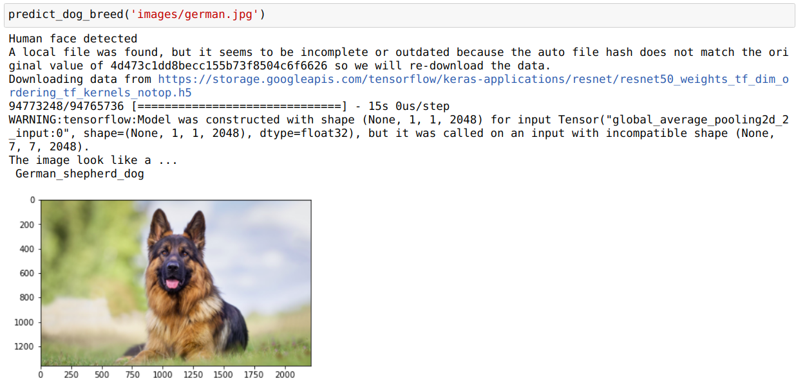
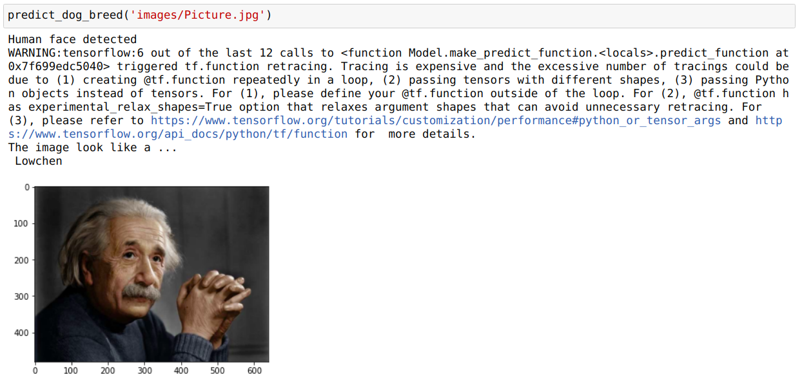
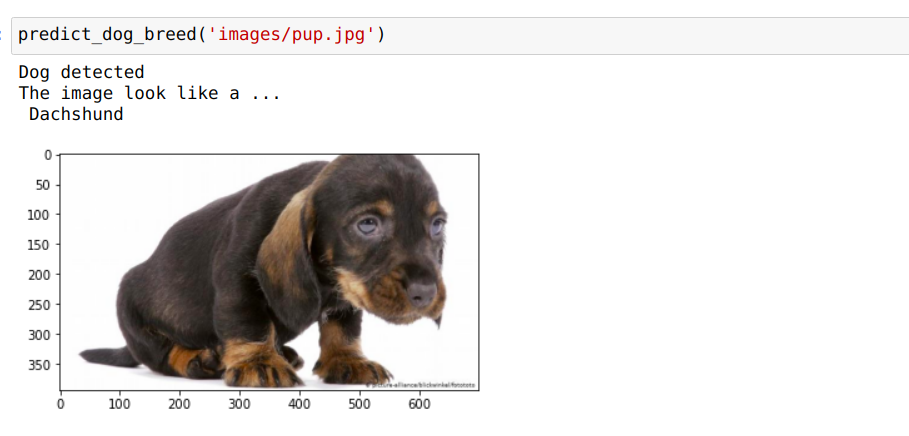

# Dog-Breed-Classification
Dog Breed Classification using CNN

# Project Overview
In this project, I build a convolutional neural network (CNN) that can identify whether the given image is either a dog or a human or none. If detected dog, then code will identify the dog breed. Otherwise, if detected human, then the code will identify the resembling dog breed.

The code is written in Python 3 and Keras with Tensorflow backend all presented in Jupyter Notebook.

## Screenshots

### Below paths not added due to high file size
/bottleneck_features, /lfw, /dogImages, etc..
Contact me at senal.dolage@gmail.com, if this entire project is needed 
